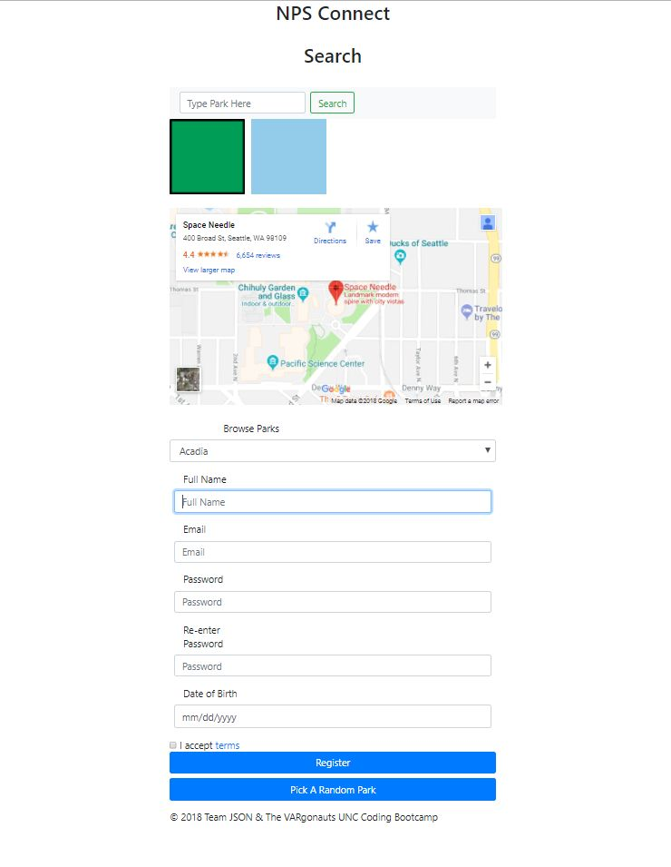

# imaginethat.github.io-applicationProjectShare-
These are my files for reference integrated with Isotopes Packery Library. They include snippets of our code share. And it has been completely formated for Jeanie's design . 

I need content as well. Social links. Facebook stuffs. other goodies. 

Firebase is also Hooked up and integrated, for Mark to easily expand on. I can verify the DB is working. 

Connection to NPS is working. But we need a way to query the api. and show content. 

